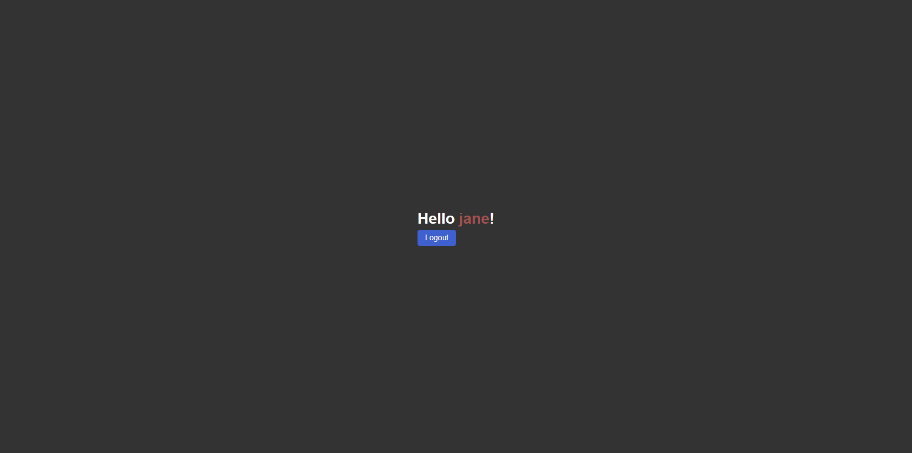
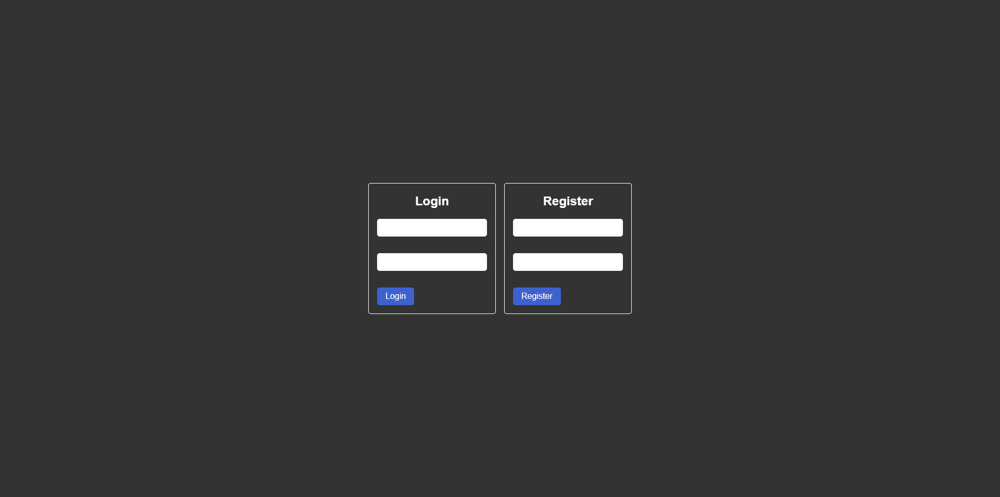

# Simple Express Auth Server with EJS Templates

<div style="display: flex; gap: 12px">

</div>
</br>
This is a simple Express server with EJS templates for authentication. I have created this for the purpose of practice. I would appreciate any suggestions for improvement.

## Features

- typescript
- `express-session` for session management
- password hashing

## Installation

```bash
npm i | yarn
```

## Launch

```bash
npm run dev | yarn dev
```
